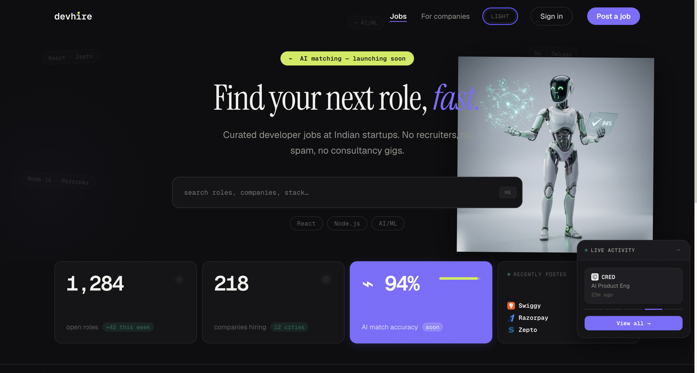

# DevHire

AI-powered job board. Browse job listings, post new jobs, and generate tailored cover letters using the Gemini API.

## Screenshots



## Stack

| Layer | Tech |
|---|---|
| Frontend | React 19, Redux Toolkit, Tailwind CSS, Vite |
| Backend | Node.js, Express, MongoDB Atlas, Mongoose |
| AI | Google Gemini API |
| Deploy | Vercel (frontend) · Render (backend) |

## Features (V1)

- Browse all job listings
- Post a new job (title, company, description, salary)
- Generate a cover letter for any listing via Gemini AI
- Loading + error states on all async operations

## Local development

### Frontend
```bash
npm install
npm run dev       # http://localhost:5173
```

### Backend
```bash
cd server
npm install
node server.js    # http://localhost:5000
```

### Environment variables

Create `/.env` for frontend:
```
VITE_API_URL=http://localhost:5000
```

Create `/server/.env` for backend:
```
PORT=5000
MONGODB_URI=your_mongodb_atlas_uri
GEMINI_API_KEY=your_gemini_api_key
```

## Project structure

```
devhire/
  src/
    components/     # JobCard, JobForm, JobList, Navbar
    store/          # Redux store + jobSlice
    services/       # axios API calls
    utils/          # helpers
  server/
    models/         # Job.js Mongoose schema
    routes/         # /api/jobs, /api/ai/cover
    config/         # MongoDB connection
    server.js       # Express entry point
```

## API

| Method | Endpoint | Description |
|---|---|---|
| GET | `/api/jobs` | Fetch all jobs |
| POST | `/api/jobs` | Create a new job |
| POST | `/api/ai/cover` | Generate cover letter via Gemini |

## Roadmap

- [ ] Job listings page
- [ ] Post a job form
- [ ] Gemini cover letter generation
- [ ] Backend REST API
- [ ] MongoDB Atlas integration
- [ ] Deploy to Vercel + Render
