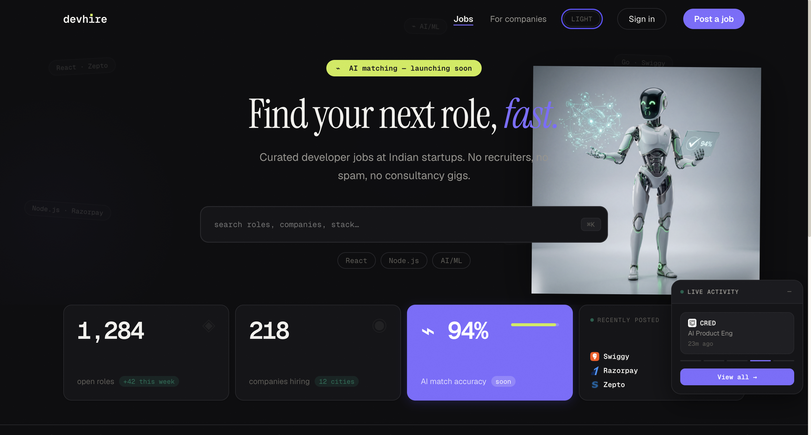

# DevHire

Full-stack job board for developer roles at Indian startups. Employers post openings, candidates browse and filter them.

## Live Demo

🔗 **https://devhire-neon.vercel.app**

## App Overview



## Stack

| Layer | Tech |
|---|---|
| Frontend | React 19, Vite, hash routing, inline-styled design system (`src/design`) |
| Backend | Node.js, Express, MongoDB Atlas, Mongoose |
| Auth | JWT, bcrypt |
| AI | Anthropic Claude API (`@anthropic-ai/sdk`) |
| Deploy | Vercel (frontend) · Render (backend) |

## Features

- Browse job listings with search, stack filters, and sorting
- Register / login with JWT authentication (bcrypt-hashed passwords)
- Post a job (protected — authenticated users only)
- Edit / delete your own listings (ownership check — other users get 403)
- Job detail pages
- Live job feed: developer jobs imported every 30 min from free public APIs (Remotive, Arbeitnow, Greenhouse career feeds), deduplicated in MongoDB and shown with a "via source" tag
- AI match score: paste your resume, get a 0–100 fit score with strengths and gaps (Anthropic Claude API)
- AI cover-letter generation from your resume and the job description (Anthropic Claude API)
- Save jobs and track the ones you applied to (My jobs)
- Profile with PDF / text resume upload — the resume powers the AI features
- Employer dashboard: your listings, applicants ranked by match score, shortlist / reject
- Company pages with every open role at that company
- Page transitions, parallax banners and looping background video (poster image on phones / reduced motion)
- Responsive layout, loading and error states on all async operations

## Local development

### Backend
```bash
cd server
npm install
npm run dev       # http://localhost:5001
```

### Frontend
```bash
npm install
npm run dev       # http://localhost:5173
```

### Environment variables

`/server/.env`:

PORT=5001
MONGODB_URI=your_mongodb_atlas_uri
JWT_SECRET=your_jwt_secret
CORS_ORIGINS=https://your-frontend-domain
ANTHROPIC_API_KEY=your_anthropic_api_key   # optional — enables the AI features
JOB_SYNC_MINUTES=30                        # optional — live job import interval (JOB_SYNC=off disables)
GREENHOUSE_BOARDS=                         # optional — "board:Company Name,..." official career feeds

`/.env` (frontend, optional — defaults to localhost):

VITE_API_URL=http://localhost:5001/api

## API

| Method | Endpoint | Auth | Description |
|---|---|---|---|
| POST | `/api/auth/register` | — | Create account |
| POST | `/api/auth/login` | — | Login, returns JWT |
| GET | `/api/jobs` | — | Fetch all jobs (`?source=devhire` or `?source=external` to filter) |
| GET | `/api/jobs/:id` | — | Fetch single job |
| POST | `/api/jobs` | ✓ | Create a job |
| PUT | `/api/jobs/:id` | ✓ | Update own job |
| DELETE | `/api/jobs/:id` | ✓ | Delete own job |
| POST | `/api/ai/match/:jobId` | ✓ | Resume vs job match score |
| POST | `/api/ai/cover-letter/:jobId` | ✓ | Generate a cover letter |
| GET | `/api/me/jobs` | ✓ | My saved and applied jobs |
| POST / DELETE | `/api/me/saved/:jobId` | ✓ | Save / unsave a job |
| POST | `/api/me/applied/:jobId` | ✓ | Record an application (scored for the employer) |
| GET / PUT | `/api/me/profile` | ✓ | Read / update my profile |
| POST | `/api/me/resume` | ✓ | Upload a PDF or .txt resume (multipart field `resume`, max 2 MB) |
| GET | `/api/employer/jobs` | ✓ | My listings with applicant counts |
| GET | `/api/employer/jobs/:id/applicants` | ✓ | Applicants for one of my listings, best match first |
| PATCH | `/api/employer/applications/:id` | ✓ | Set status: `New`, `Shortlisted` or `Rejected` |
| GET | `/api/companies/:name` | — | Company profile and its open roles |

## Roadmap

- [x] Backend REST API with JWT auth
- [x] MongoDB Atlas integration
- [x] Job listings, filters, search, detail pages
- [x] Post a job (protected)
- [x] Deploy to Vercel + Render
- [x] AI-powered candidate–JD matching (Anthropic Claude API)
- [x] Cover letter generation (Anthropic Claude API)
