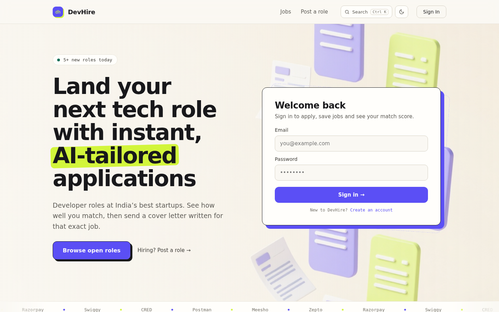
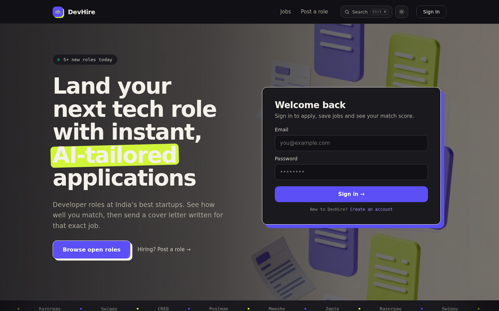
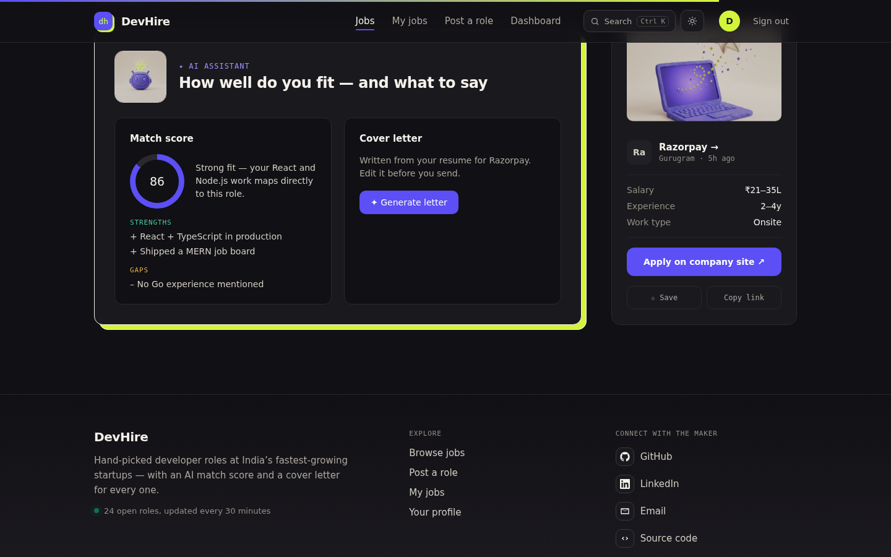
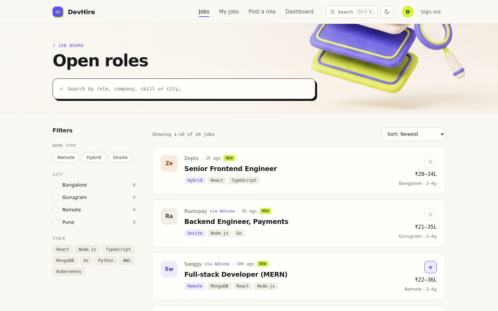
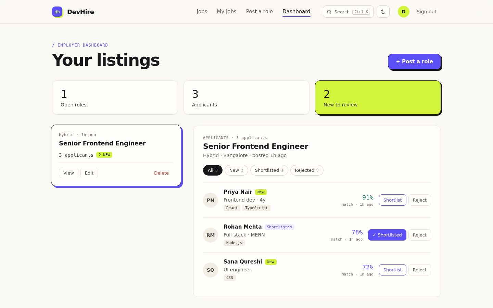

# DevHire

Full-stack job board for developer roles at Indian startups. Candidates browse live jobs, upload a resume and get a match score and a tailored cover letter for every role. Employers post openings and review applicants, ranked by fit.

**Live demo:** https://devhire-neon.vercel.app



| Dark mode | Match score |
|---|---|
|  |  |

| Job board | Employer dashboard |
|---|---|
|  |  |

## Stack

| Layer | Tech |
|---|---|
| Frontend | React 19, Vite, hash routing, Lenis smooth scrolling, inline-styled design system with light/dark tokens (`src/design`) |
| Backend | Node.js, Express, MongoDB Atlas, Mongoose |
| Auth | JWT, bcrypt |
| Match score & letters | LLM API (Anthropic SDK), structured JSON output |
| Jobs data | Adzuna India API, Greenhouse career feeds |
| Deploy | Vercel (frontend) · Render (backend) |

## Features

### For candidates
- **Live job feed:** developer jobs across Indian cities, imported from Adzuna and Greenhouse, deduplicated in MongoDB and tagged with their source.
- **Job board:** search, filters (work type, city, stack), sorting (newest, salary, company) and pagination.
- **Match score:** a 0–100 fit score for each job, with strengths and gaps based on your resume.
- **Cover letters:** drafted from your resume and the job description, ready to edit and copy.
- **Profile:** upload a PDF or text resume; its text is extracted on the server and used for match scores and letters.
- **My jobs:** save jobs and track the ones you applied to.
- **Company pages:** every open role at a company, with a short profile.

### For employers
- Post, edit and delete your own listings (ownership is checked on the server).
- A dashboard with applicant counts, applicants ranked by match score, and shortlist / reject.

### Interface
- Light and dark mode: follows the OS setting, remembers your choice, and switches with a circular reveal animation.
- ⌘K / Ctrl+K (or `/`) search palette for jobs, companies, pages and actions.
- Smooth scrolling, page transitions, reveal-on-scroll, parallax banners and a cursor spotlight on cards.
- A top loading bar, skeleton placeholders while jobs load, toast confirmations and a back-to-top button.
- Responsive layout with a slide-in menu on phones. Phones and reduced-motion users get still images and normal scrolling.

## Local development

### Backend
```bash
cd server
npm install
npm run dev       # http://localhost:5001
```

### Frontend
```bash
npm install
npm run dev       # http://localhost:5173
```

### Environment variables

`server/.env`:

```bash
PORT=5001
MONGODB_URI=your_mongodb_atlas_uri
JWT_SECRET=your_jwt_secret
CORS_ORIGINS=https://your-frontend-domain   # comma-separated, no trailing slash
ANTHROPIC_API_KEY=your_anthropic_api_key    # enables match scores and cover letters
ADZUNA_APP_ID=your_adzuna_app_id            # free key from developer.adzuna.com
ADZUNA_APP_KEY=your_adzuna_app_key
# Optional
JOB_SOURCES=adzuna,greenhouse               # which job sources run
JOB_SYNC_MINUTES=30                         # import interval (JOB_SYNC=off disables)
ADZUNA_EVERY_MINUTES=180                    # Adzuna's own slower interval, to stay in the free quota
GREENHOUSE_BOARDS=                          # "board:Company Name,..." career feeds
```

`.env` (frontend, optional; defaults to the local backend):

```bash
VITE_API_URL=http://localhost:5001/api
```

## Project structure

```
src/
  App.jsx              routing, state, and the view model passed to every page
  design/              Shell, Footer, pages/*, ambient pieces, extras (⌘K, toasts), design.css
  hooks/               useJobs, useMyJobs, useProfile, useEmployer, useTheme, usePageMotion
  utils/               routes, job normalisation, formatting helpers
server/
  routes/              auth, jobs, me, employer, companies, ai
  services/jobSync.js  scheduled job import
  utils/match.js       match score used to rank applicants
```

## API

| Method | Endpoint | Auth | Description |
|---|---|---|---|
| POST | `/api/auth/register` | — | Create account |
| POST | `/api/auth/login` | — | Log in, returns a JWT |
| GET | `/api/jobs` | — | All jobs (`?source=devhire` or `?source=external` to filter) |
| GET | `/api/jobs/:id` | — | One job |
| POST | `/api/jobs` | ✓ | Create a job |
| PUT | `/api/jobs/:id` | ✓ | Update your own job |
| DELETE | `/api/jobs/:id` | ✓ | Delete your own job (and its applications) |
| POST | `/api/ai/match/:jobId` | ✓ | Resume vs job match score |
| POST | `/api/ai/cover-letter/:jobId` | ✓ | Generate a cover letter |
| GET | `/api/me/jobs` | ✓ | My saved and applied jobs |
| POST / DELETE | `/api/me/saved/:jobId` | ✓ | Save / unsave a job |
| POST | `/api/me/applied/:jobId` | ✓ | Record an application (scored for the employer) |
| GET / PUT | `/api/me/profile` | ✓ | Read / update my profile |
| POST | `/api/me/resume` | ✓ | Upload a PDF or .txt resume (multipart field `resume`, max 2 MB) |
| GET | `/api/employer/jobs` | ✓ | My listings with applicant counts |
| GET | `/api/employer/jobs/:id/applicants` | ✓ | Applicants for one of my listings, best match first |
| PATCH | `/api/employer/applications/:id` | ✓ | Set status: `New`, `Shortlisted` or `Rejected` |
| GET | `/api/companies/:name` | — | Company profile and its open roles |

## Roadmap

- [x] REST API with JWT auth, MongoDB Atlas
- [x] Job listings, filters, search, detail pages
- [x] Post, edit and delete jobs
- [x] Live India job feed (Adzuna, Greenhouse)
- [x] Match score and cover letters
- [x] Saved / applied jobs, profile with resume upload
- [x] Employer dashboard with ranked applicants
- [x] Company pages
- [x] Redesign with dark mode, ⌘K search and motion
- [x] Deploy to Vercel + Render
- [ ] Email alerts for new jobs that match a saved search
- [ ] Automated tests (API + end-to-end)

## Author

Built by **Dhruv Jolly** · [GitHub](https://github.com/dhruvJolly-3) · [LinkedIn](https://www.linkedin.com/in/Dhruvjolly12)
